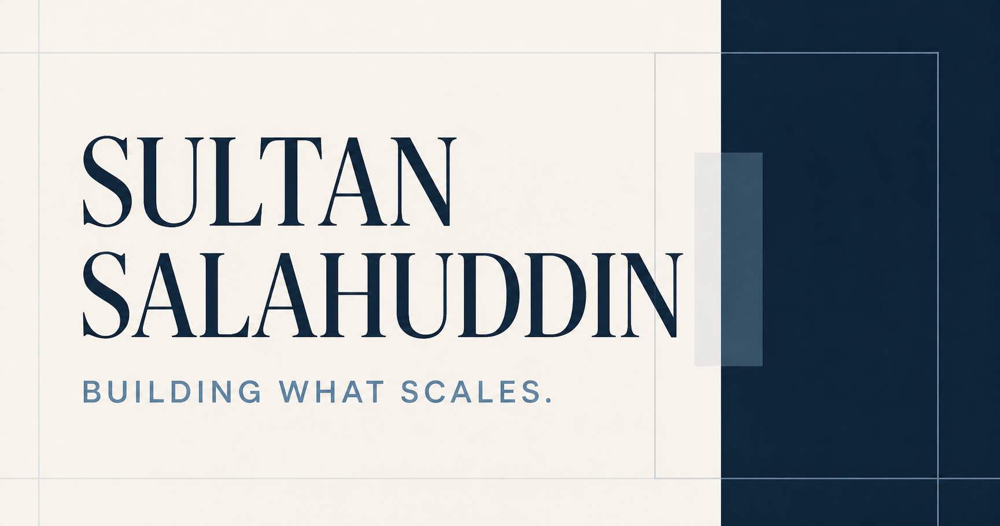

# AI Resume to Portfolio — Next.js Template

[](https://github.com/post2sultan/ai-resume-to-portfolio/actions/workflows/ci.yml)
[](LICENSE)
[](https://github.com/new?template_name=ai-resume-to-portfolio&template_owner=post2sultan)

Turn one structured résumé into a polished, responsive portfolio website using any coding LLM. This open-source Next.js portfolio template includes executive storytelling, case studies, measurable results, SEO, structured data, accessibility foundations, and publishing guidance.

[View the live portfolio demo](https://sultanofscale.com) · [Use this template](https://github.com/new?template_name=ai-resume-to-portfolio&template_owner=post2sultan)



## New to websites? Start here

**No coding experience is required.** Follow the [complete beginner’s guide](BEGINNER_GUIDE.md) to go from your existing résumé to a live portfolio website. It explains every step in plain language, including:

- creating your own copy of this template;
- giving your résumé to an AI coding assistant;
- adding photographs, links, and contact details;
- checking the website before publishing;
- buying a domain such as `yourname.com`;
- choosing hosting such as Vercel or Cloudflare;
- connecting the domain and submitting the site to search engines;
- making future changes after the site is live.

➡️ **[Build your portfolio: the beginner’s step-by-step guide](BEGINNER_GUIDE.md)**

## Why this template

Most portfolio starters still require people to rewrite components, metadata, and layouts by hand. This project gives an AI coding assistant the structure and guardrails to do that work from a single résumé brief—without locking the user into one model, hosting provider, or visual site builder.

It works for executives, operators, consultants, founders, creatives, and other professionals who want a credible personal website rather than a generic résumé page.

## What you get

- A production-ready Next.js and TypeScript portfolio
- A structured résumé input designed for reliable LLM interpretation
- Vendor-neutral instructions for Codex, Claude, Cursor, Copilot, Gemini, and comparable coding assistants
- Responsive editorial design with impact metrics, case studies, experience, skills, qualifications, and contact sections
- Search metadata, canonical URLs, Open Graph, ProfilePage/Person JSON-LD, sitemap, robots, and web manifest
- Accessibility-conscious navigation, semantic content, keyboard behavior, and reduced-motion support
- Automated GitHub quality checks and dependency maintenance
- Cloudflare, Vercel, and general Next.js deployment guidance

## The three-step workflow

1. Clone or download this repository.
2. Replace the prompts in [`resume/RESUME.md`](resume/RESUME.md) with your information and add your images to `public/`.
3. Give your LLM coding assistant the prompt in [`CUSTOMIZE_WITH_AI.md`](CUSTOMIZE_WITH_AI.md).

The assistant should rewrite the portfolio, update contact details and SEO, remove sections unsupported by the résumé, and validate the finished build. You do not need to edit the application code yourself.

> Never put passwords, API keys, identity documents, private addresses, or other secrets in the résumé file.

## Use it with any coding LLM

The workflow is vendor-neutral. It works best with a coding assistant that can read and edit a project folder, such as Codex, Claude Code, Cursor, GitHub Copilot, Gemini CLI, or a comparable tool. With a chat-only LLM, upload the project as a ZIP together with the completed résumé and ask it to return the edited project.

Copy and paste this prompt:

```text
Personalize this portfolio from resume/RESUME.md. Follow AGENTS.md and
CUSTOMIZE_WITH_AI.md exactly. Preserve the visual design, never invent facts,
remove unsupported sections gracefully, replace all demo-person information,
update SEO and structured data, and run the validation steps before finishing.
```

## Run locally

Requirements: Node.js 22.13 or newer and npm.

```bash
npm install
npm run dev
```

Open `http://localhost:3000`. To use port 3001, run `npm run dev:3001`.

Before publishing:

```bash
npm run check
```

## What the LLM changes

- Identity, domain, email, social links, hero copy, and SEO in `content/profile.ts`
- Impact metrics, case studies, experience, skills, qualifications, languages, interests, and section copy in `app/page.tsx`
- Images, logos, résumé download, favicon, and social preview files in `public/`
- Optional presentation details in `app/globals.css` only when the résumé asks for a different visual direction

The current Sultan of Scale portfolio is included as demo content so users can see a completed result before personalizing it.

## Publish

The project is a standard Next.js application. See [`docs/PUBLISHING.md`](docs/PUBLISHING.md) for Cloudflare, Vercel, and other hosting options. Hosting accounts, IDs, DNS records, and credentials are intentionally not included.

## Design system

The palette, typography, spacing, and component principles are documented in [`docs/DESIGN_SYSTEM.md`](docs/DESIGN_SYSTEM.md).

## License and asset rights

The source code and original design implementation are available under the [MIT License](LICENSE). Demo biographies, personal photographs, company logos, trademarks, and third-party materials are excluded from that license; see [NOTICE.md](NOTICE.md). Replace demo assets and claims before publishing your version.

Contributions are welcome. See [CONTRIBUTING.md](CONTRIBUTING.md).
